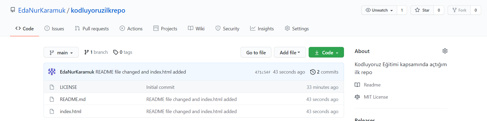

# Kodluyoruz Ilk Repo
Bu repo [Kodluyoruz](https://www.kodluyoruz.org) Front-End Eğitiminde oluşturduğumuz ilk repo. İçerisinde bir adet README dosyası, bir adet de index.html barındırıyor.

[](https://github.com/EdaNurKaramuk/kodluyoruzilkrepo/?target=_blank)

## Installation
Öncelikle projeyi cloneluyoruz.

```
git clone https://github.com/EdaNurKaramuk/kodluyoruzilkrepo.git
```

## Usage
Projeyi cloneladıktan sonra Visual Studio Code programında açıyoruz.
Windows için:

```
cd kodluyoruzilkrepo
code .
```

## Contributing
Pull requestler kabul edilir. Büyük değişiklikler için, lütfen önce neyi değiştirmek istediğinizi tartışmak için bir konu açınız.

## License
[MIT](https://choosealicense.com/licenses/mit/)
